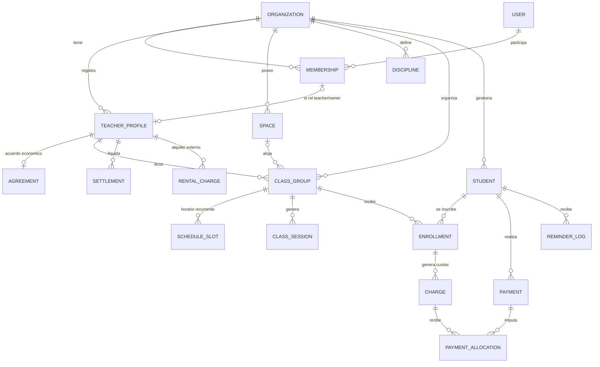

# Ritma — Plan de proyecto

> Nombre provisorio. Sistema de gestión para docentes independientes y estudios (danza, fitness, música, idiomas, oficios).
> Versión 0.1 · Julio 2026 · Estado: definición de producto

---

## 1. Resumen ejecutivo

Ritma es una web app **mobile-first** para que docentes y estudios gestionen tres cosas que hoy viven repartidas entre cuaderno, Excel y WhatsApp: **agenda de clases**, **padrón de alumnos** y **cobranzas**.

El MVP se construye como producto propio, sin modelo de negocio definido aún, pero con una decisión estructural clave: **arquitectura multi-tenant desde el día 1**. Todo dato cuelga de una Organización. Si mañana se convierte en SaaS, lo que falta es billing y onboarding — no una re-arquitectura.

Decisiones de alcance ya tomadas:

| Decisión | Elección | Consecuencia |
|---|---|---|
| Modelo | MVP propio, SaaS-ready | Multi-tenant desde el día 1, sin billing propio en MVP |
| Cobro de cuotas | Registro manual + comprobantes | Sin pasarela de pago en MVP; foco en UX de carga rápida |
| Acceso de alumnos | No acceden a la app | Alumnos son datos, no usuarios; comunicación por WhatsApp/email |

## 2. Problema y propuesta de valor

**El problema.** Un profe independiente lleva sus alumnos en un cuaderno o Excel, cobra por transferencia o efectivo, y persigue deudores por WhatsApp uno por uno. Un estudio suma complejidad: varios profes, salones compartidos, y un reparto de plata (porcentaje para staff, alquiler para externos) que se calcula a mano a fin de mes y siempre genera fricción.

**La propuesta.** Una sola app donde:

1. La agenda semanal de clases (propia o del estudio, por salón) está siempre visible y actualizada.
2. Cada alumno tiene su estado de cuenta claro: qué debe, qué pagó, desde cuándo.
3. Registrar un pago toma menos de 15 segundos y genera un comprobante prolijo, compartible por WhatsApp en un tap.
4. Los recordatorios de cobro salen pre-armados (mensaje + monto + período) por WhatsApp o email.
5. El cierre de mes del estudio (liquidación de cada profe, alquileres pendientes) se calcula solo.

**Diferencial vs. competencia** (Fitco, Crossfy, apps de gimnasios): foco en estudios chicos y profes independientes del mundo artístico/educativo, con el **reparto profe–estudio** como ciudadano de primera clase, y sin obligar a los alumnos a instalarse nada.

## 3. Glosario y definiciones del dominio

Estas definiciones son normativas: el código, la base de datos y la UI usan estos términos.

| Término | Definición |
|---|---|
| **Organización** | El tenant. Unidad de aislamiento de datos. Tipos: `independiente` (un profe que trabaja solo) o `estudio` (espacio con varios profes). Toda entidad del sistema referencia a una organización. |
| **Usuario** | Persona con cuenta y login. Puede pertenecer a varias organizaciones. |
| **Membresía** | Vínculo usuario ↔ organización con un rol: `owner`, `admin` o `teacher`. |
| **Profe** | Perfil docente dentro de una organización. Relación económica: `titular` (dueño en org independiente), `staff` (parte del estudio, comparte porcentaje) o `externo` (alquila el salón, gestiona lo suyo por fuera). Un profe externo puede no tener usuario: el estudio solo registra su alquiler. |
| **Acuerdo económico** | Regla de reparto entre profe y estudio. Tipo `porcentaje`: el estudio retiene X% de lo cobrado a alumnos del profe. Tipo `alquiler`: el profe paga un monto fijo (por hora, por turno o mensual) por el uso del espacio. |
| **Espacio** | Salón o sala física del estudio, reservable. Las orgs independientes pueden no usar espacios. |
| **Disciplina** | Estilo o materia: árabe, folklore, funcional, canto, inglés. Catálogo propio de cada organización. |
| **Grupo (comisión)** | Conjunto de alumnos con un horario recurrente, una disciplina, un profe, opcionalmente un espacio, y una tarifa de referencia. Es la unidad central de la agenda. |
| **Horario recurrente** | Regla simple de repetición de un grupo: día de semana + hora de inicio + duración. Un grupo puede tener varios (ej.: martes y jueves 19:00). |
| **Sesión** | Ocurrencia concreta de un grupo en una fecha. Se genera a partir del horario recurrente y puede cancelarse o reprogramarse sin afectar la regla. |
| **Alumno** | Persona gestionada por la organización. **No tiene login.** Datos mínimos: nombre y teléfono (para WhatsApp); email opcional. |
| **Inscripción** | Vínculo alumno ↔ grupo, con plan de precios, precio pactado y fechas de alta/baja. Un alumno puede tener varias inscripciones. |
| **Plan de precios** | Cómo paga el alumno esa inscripción: `mensual` (cuota por mes calendario), `pack` (N clases, fase 2) o `clase suelta`. |
| **Cuota (cargo)** | Deuda generada para una inscripción en un período. Ej.: "Marzo 2026 · Árabe intermedio · $20.000". Estados: `pendiente`, `parcial`, `pagada`, `vencida`, `exonerada`. |
| **Pago** | Dinero registrado a favor de la organización, hecho por un alumno. Atributos clave: monto, fecha, método (`efectivo`, `transferencia`, `otro`), **quién lo recibió** (`estudio` o `profe` — esto define la liquidación), comprobante adjunto opcional (foto de transferencia). |
| **Imputación** | Asignación de un pago a una o más cuotas. Permite pagos parciales y pagos que cubren varios meses. |
| **Comprobante** | Documento generado por la app para cada pago: página pública con token firmado + imagen compartible. El alumno lo recibe por WhatsApp o email sin necesitar cuenta. |
| **Recordatorio** | Mensaje de cobro a un alumno con deuda. En MVP se envía vía deep link de WhatsApp (`wa.me`) con texto pre-armado, o por email. Queda registrado en un log. |
| **Liquidación** | Cierre periódico (mensual) por profe staff: total cobrado a sus alumnos, retención del estudio, lo que el profe ya cobró en mano, y el neto a transferir (en cualquiera de las dos direcciones). |
| **Cargo de alquiler** | Deuda de un profe externo hacia el estudio por el uso de espacios en un período. |

## 4. Roles y permisos

| Capacidad | Owner | Admin | Teacher |
|---|:---:|:---:|:---:|
| Configurar organización, acuerdos y precios | ✔ | ✔ | ✖ |
| Invitar usuarios y asignar roles | ✔ | ✔ | ✖ |
| Ver toda la agenda, alumnos y pagos de la org | ✔ | ✔ | ✖ |
| Gestionar espacios y alquileres | ✔ | ✔ | ✖ |
| Generar y cerrar liquidaciones | ✔ | ✔ | solo ver la propia |
| Gestionar **sus** grupos, horarios y sesiones | ✔ | ✔ | ✔ |
| Gestionar **sus** alumnos e inscripciones | ✔ | ✔ | ✔ |
| Registrar pagos y compartir comprobantes de sus alumnos | ✔ | ✔ | ✔ |
| Enviar recordatorios a sus alumnos | ✔ | ✔ | ✔ |

Reglas transversales:

- El scope de un `teacher` es siempre "sus grupos y los alumnos inscriptos en ellos".
- En una org `independiente`, el owner es a la vez el único profe: la UI oculta todo lo relativo a estudio (espacios, liquidaciones, roles).
- Los alumnos no son usuarios: no existe login de alumno en el MVP.

## 5. Alcance del MVP

### Dentro del MVP (fases 0–2)

- Registro/login, creación de organización con wizard (independiente o estudio).
- CRUD de alumnos con búsqueda rápida y alta express (nombre + teléfono).
- Disciplinas, grupos, horarios recurrentes y agenda semanal (vista día/semana, mobile-first).
- Sesiones generadas de la agenda; cancelar/reprogramar una fecha puntual.
- Planes mensuales y clase suelta; generación automática de cuotas por período (cron).
- Registro de pagos con imputación a cuotas, pagos parciales, adjunto de comprobante de transferencia.
- Comprobante generado por la app: link público con token + imagen compartible (Web Share API / WhatsApp).
- Lista de deudores por período y recordatorios por deep link de WhatsApp y por email.
- Dashboard: cobrado del mes, pendiente, próximos vencimientos, clases de hoy.
- Estudio: invitaciones y roles, espacios y calendario por salón, acuerdos económicos, liquidaciones mensuales de staff, cargos de alquiler de externos.

### Fuera del MVP (backlog, fase 3+)

- Cobro online (Mercado Pago: checkout de cuotas + webhooks de conciliación).
- Portal/app de alumno (ver su estado de cuenta, inscribirse, pagar).
- WhatsApp Cloud API (envío automático sin abrir la app de WhatsApp).
- Asistencia y packs de N clases (dependen de tomar asistencia).
- Recargos por mora automáticos y prorrateos configurables avanzados.
- Gastos del estudio y reportes contables completos.
- Facturación fiscal (AFIP/ARCA), multi-moneda, multi-idioma.
- Vínculo entre cuentas (profe externo con su propia org linkeada al estudio).
- Billing del SaaS, landing pública, planes y pricing.

## 6. Épicas e historias de usuario

Formato: HU con criterios de aceptación (CA). "Profe" refiere a cualquier rol con permiso sobre sus grupos; "Admin" incluye al owner.

### E1 — Onboarding y organización

- **HU1.1** Como usuario nuevo, quiero crear mi cuenta y mi espacio de trabajo en menos de 2 minutos.
  - CA: registro con email+contraseña y con Google; wizard de 3 pasos (nombre de la org, tipo independiente/estudio, disciplinas iniciales); al terminar veo el dashboard con un CTA "Creá tu primer grupo".
- **HU1.2** Como owner, quiero configurar moneda, día de vencimiento de cuotas y datos de contacto de la org.
  - CA: defaults ARS, vencimiento día 10, zona horaria America/Argentina/Buenos_Aires; todo editable en Ajustes.
- **HU1.3** Como owner de estudio, quiero invitar profes por email o link y asignarles rol.
  - CA: invitación con link de un solo uso; al aceptar, el usuario queda con membresía `teacher` y perfil de profe; puedo revocar acceso sin borrar su historial.

### E2 — Alumnos

- **HU2.1** Como profe, quiero dar de alta un alumno en segundos, incluso en medio de una clase.
  - CA: formulario express con solo nombre y teléfono; el resto (email, notas, fecha de nacimiento) es opcional y editable después; validación de teléfono en formato internacional para wa.me.
- **HU2.2** Como profe, quiero buscar un alumno por nombre y ver su ficha completa.
  - CA: búsqueda con resultados al tipear; la ficha muestra inscripciones activas, estado de cuenta (cuotas y pagos) e historial de recordatorios.
- **HU2.3** Como profe, quiero dar de baja un alumno conservando su historial.
  - CA: baja lógica; no se generan cuotas futuras; el alumno deja de aparecer en listas activas pero su historial de pagos queda consultable.

### E3 — Agenda: grupos, horarios y sesiones

- **HU3.1** Como profe, quiero crear un grupo con disciplina, horario recurrente, tarifa de referencia y (si aplica) salón.
  - CA: un grupo admite múltiples franjas (ej. martes y jueves 19:00–20:30); en estudios, elegir salón valida que no haya superposición con otro grupo en ese espacio.
- **HU3.2** Como profe, quiero ver mi semana de un vistazo desde el celular.
  - CA: vista semanal y de día con las sesiones; tap en una sesión abre detalle con el grupo y sus inscriptos.
- **HU3.3** Como profe, quiero cancelar o mover una sesión puntual sin tocar el horario recurrente.
  - CA: la sesión queda marcada `cancelada` o con nueva fecha/hora; el resto de las semanas no cambia.
- **HU3.4** Como admin de estudio, quiero ver el calendario completo por salón.
  - CA: vista por espacio con todos los grupos (staff y externos); los huecos libres son visibles para ofrecer alquileres.

### E4 — Cobranzas: planes, cuotas y pagos

- **HU4.1** Como profe, quiero inscribir un alumno a un grupo con un plan y precio.
  - CA: plan mensual (default, hereda tarifa del grupo, editable por alumno) o clase suelta; fecha de alta define desde qué período se generan cuotas.
- **HU4.2** Como sistema, quiero generar las cuotas mensuales automáticamente.
  - CA: cron el día 1 de cada mes crea una cuota `pendiente` por cada inscripción mensual activa; si un alumno se inscribe a mitad de mes, se genera la cuota del mes en curso (completa por default; ver Reglas de negocio).
- **HU4.3** Como profe, quiero registrar un pago en menos de 15 segundos.
  - CA: desde la ficha del alumno o desde la lista de deudores: monto (pre-cargado con la deuda), método, quién lo recibió (solo visible en estudios), fecha (default hoy), foto de comprobante opcional; la imputación a cuotas es automática (más antigua primero) y editable.
- **HU4.4** Como profe, quiero registrar pagos parciales y pagos que cubren varios meses.
  - CA: un pago se imputa a N cuotas; una cuota con imputaciones por menos del total queda `parcial`; el remanente sin imputar queda como saldo a favor visible en la ficha.
- **HU4.5** Como sistema, quiero marcar cuotas vencidas.
  - CA: cron diario pasa a `vencida` toda cuota `pendiente`/`parcial` cuya fecha de vencimiento ya pasó.

### E5 — Comprobantes y recordatorios

- **HU5.1** Como profe, quiero que cada pago genere un comprobante prolijo para mandarle al alumno.
  - CA: al registrar el pago se genera una página pública `/r/{token}` (sin login, token firmado no adivinable) con logo/nombre de la org, alumno, concepto, período, monto, método y fecha; botón "Compartir" usa Web Share API en mobile y copia el link en desktop.
- **HU5.2** Como profe, quiero mandar un recordatorio de deuda por WhatsApp en dos taps.
  - CA: desde la lista de deudores, botón WhatsApp abre wa.me/{teléfono} con mensaje pre-armado (plantilla editable en Ajustes: nombre, período, monto, alias/CBU); el envío queda logueado con fecha y canal.
- **HU5.3** Como profe, quiero enviar el mismo recordatorio por email si el alumno no usa WhatsApp.
  - CA: envío vía proveedor transaccional con la misma plantilla; log unificado.

### E6 — Estudio multi-profe (fase 2)

- **HU6.1** Como admin, quiero definir el acuerdo económico de cada profe.
  - CA: staff → porcentaje de retención del estudio (ej. 30%); externo → alquiler por hora, por turno o mensual; el acuerdo tiene vigencia (fecha desde) y su histórico se conserva.
- **HU6.2** Como admin, quiero generar la liquidación mensual de cada profe staff.
  - CA: para un período, el sistema calcula bruto cobrado a alumnos del profe, retención, cobrado en mano por el profe y neto resultante (ver fórmula en Reglas de negocio); la liquidación se cierra con estado `pagada` y queda inmutable; exportable/compartible.
- **HU6.3** Como admin, quiero llevar el alquiler de los profes externos.
  - CA: los cargos de alquiler se generan según el acuerdo (mensual fijo o por sesiones dictadas en espacios del estudio); pueden marcarse pagados con fecha y método.
- **HU6.4** Como profe staff, quiero ver mi liquidación y el detalle que la compone.
  - CA: el teacher ve solo sus liquidaciones, con el listado de pagos que la integran.

### E7 — Dashboard y reportes

- **HU7.1** Como profe, quiero abrir la app y saber al instante cómo viene el mes.
  - CA: cobrado del mes, pendiente de cobro, cantidad de deudores, clases de hoy; cada card linkea a su detalle.
- **HU7.2** Como admin de estudio, quiero ver ingresos por profe y por disciplina del período.
  - CA: tabla simple con totales; exportación CSV.

## 7. Modelo de dominio

### Diagrama entidad–relación



### Esquema Prisma (borrador condensado)

```prisma
model Organization {
  id        String  @id @default(cuid())
  name      String
  type      OrgType            // INDEPENDENT | STUDIO
  currency  String  @default("ARS")
  timezone  String  @default("America/Argentina/Buenos_Aires")
  dueDay    Int     @default(10)   // día de vencimiento de cuotas
  reminderTemplate String?         // plantilla de recordatorio
}

model User {
  id    String @id @default(cuid())
  email String @unique
  name  String
}

model Membership {
  userId String
  orgId  String
  role   Role                   // OWNER | ADMIN | TEACHER
  @@id([userId, orgId])
}

model TeacherProfile {
  id           String  @id @default(cuid())
  orgId        String
  membershipUserId String?       // null si es externo sin cuenta
  displayName  String
  kind         TeacherKind      // OWNER_TEACHER | STAFF | EXTERNAL
}

model Agreement {
  id            String @id @default(cuid())
  teacherId     String
  type          AgreementType   // REVENUE_SHARE | RENTAL
  studioPercent Decimal?        // ej. 30.0 si REVENUE_SHARE
  rentalAmount  Decimal?        // si RENTAL
  rentalPeriod  RentalPeriod?   // PER_HOUR | PER_SESSION | MONTHLY
  validFrom     DateTime
}

model Space      { id String @id @default(cuid()); orgId String; name String }
model Discipline { id String @id @default(cuid()); orgId String; name String }

model ClassGroup {
  id           String  @id @default(cuid())
  orgId        String
  teacherId    String
  disciplineId String
  spaceId      String?
  name         String
  defaultPrice Decimal
  active       Boolean @default(true)
}

model ScheduleSlot {
  id          String @id @default(cuid())
  groupId     String
  weekday     Int      // 0..6
  startTime   String   // "19:00" hora local de la org
  durationMin Int
}

model ClassSession {
  id      String  @id @default(cuid())
  groupId String
  date    DateTime
  status  SessionStatus  // SCHEDULED | CANCELLED | DONE
  note    String?
}

model Student {
  id     String  @id @default(cuid())
  orgId  String
  name   String
  phone  String?   // E.164 para wa.me
  email  String?
  note   String?
  active Boolean @default(true)
}

model Enrollment {
  id        String   @id @default(cuid())
  studentId String
  groupId   String
  plan      PlanType     // MONTHLY | PACK | DROP_IN
  price     Decimal
  startDate DateTime
  endDate   DateTime?
}

model Charge {
  id           String @id @default(cuid())
  orgId        String
  enrollmentId String
  period       String       // "2026-07"
  amount       Decimal
  dueDate      DateTime
  status       ChargeStatus // PENDING | PARTIAL | PAID | OVERDUE | WAIVED
  @@unique([enrollmentId, period])
}

model Payment {
  id            String   @id @default(cuid())
  orgId         String
  studentId     String
  amount        Decimal
  method        PayMethod    // CASH | TRANSFER | OTHER
  receivedBy    ReceivedBy   // STUDIO | TEACHER
  receivedById  String?      // teacherId si lo cobró el profe
  paidAt        DateTime
  attachmentUrl String?      // foto de la transferencia
  receiptToken  String  @unique  // link público del comprobante
  settlementId  String?      // set al cerrar la liquidación
}

model PaymentAllocation {
  paymentId String
  chargeId  String
  amount    Decimal
  @@id([paymentId, chargeId])
}

model Settlement {
  id                 String @id @default(cuid())
  orgId              String
  teacherId          String
  period             String
  gross              Decimal  // cobrado a alumnos del profe
  studioShare        Decimal  // retención
  collectedByTeacher Decimal  // ya cobrado en mano por el profe
  netToTeacher       Decimal  // puede ser negativo
  status             SettlementStatus // OPEN | CLOSED | PAID
}

model RentalCharge {
  id        String @id @default(cuid())
  orgId     String
  teacherId String
  period    String
  amount    Decimal
  status    ChargeStatus
}

model ReminderLog {
  id        String   @id @default(cuid())
  orgId     String
  studentId String
  chargeId  String?
  channel   Channel   // WHATSAPP_LINK | EMAIL
  sentAt    DateTime
}
```

Convenciones: toda tabla de negocio lleva `orgId` con índice; se accede solo a través de helpers que fuerzan el scoping por organización (nunca `prisma.x.findMany` "a mano" en código de aplicación).

Toda tabla lleva además `createdAt` (`@default(now())`) y `updatedAt` (`@updatedAt`) — omitidos en el borrador de arriba por brevedad, igual que las relaciones. Better Auth los exige en `User` (F0.4), y sin ellos no hay forma de auditar ni depurar nada. Los ids son `cuid()`.

## 8. Reglas de negocio

**RN1 — Generación de cuotas.** El día 1 de cada mes, un cron crea una cuota `pendiente` por cada inscripción mensual activa, con `amount = enrollment.price` y `dueDate = día de vencimiento de la org`. La cuota es única por (inscripción, período).

**RN2 — Alta a mitad de mes.** Default: se genera la cuota completa del mes en curso. Ajuste manual permitido (el profe puede editar el monto de esa primera cuota). El prorrateo automático configurable queda para fase 3 — es una fuente clásica de scope creep.

**RN3 — Estados de cuota.** `pendiente` → (`parcial` si tiene imputaciones menores al total) → `pagada` cuando la suma de imputaciones iguala el monto. `pendiente`/`parcial` pasan a `vencida` cuando `hoy > dueDate` (cron diario); una cuota vencida que se paga pasa directo a `pagada`. `exonerada` es un cierre manual sin pago (beca, canje) y requiere rol admin.

**RN4 — Imputación de pagos.** Un pago se imputa automáticamente a las cuotas impagas del alumno, de la más antigua a la más nueva. La imputación es editable antes de cerrar la liquidación del período. El excedente queda como saldo a favor y se imputa automáticamente a la próxima cuota generada.

**RN5 — Quién recibió la plata.** Todo pago en un estudio registra `receivedBy`: `estudio` o `profe`. Esto no cambia el estado de cuenta del alumno (su cuota queda pagada igual), pero sí el resultado de la liquidación.

**RN6 — Liquidación de profes staff.** Para un profe con retención `r` en un período:

```
bruto  B = suma de pagos imputados a cuotas de grupos del profe en el período
retención R = B × r
cobrado en mano C = suma de esos pagos con receivedBy = profe
neto al profe N = (B − R) − C
```

Si `N > 0`, el estudio le debe al profe; si `N < 0`, el profe le debe al estudio (cobró en mano más de lo que le corresponde). Ejemplo: B = $500.000, r = 30% → R = $150.000; el profe cobró en mano C = $200.000 → N = $350.000 − $200.000 = **$150.000 a favor del profe**. Al cerrar la liquidación, los pagos incluidos quedan vinculados a ella y dejan de ser editables.

**RN7 — Alquileres de externos.** Acuerdo `mensual`: un cargo fijo por período. Acuerdo `por hora/turno`: el cargo del período se calcula sobre las sesiones no canceladas de sus grupos en espacios del estudio. El estado del cargo (`pendiente`/`pagada`/`vencida`) sigue las mismas reglas que las cuotas.

**RN8 — Cancelación de sesiones.** Cancelar una sesión no modifica cuotas mensuales (el plan mensual no descuenta por clase). Sí afecta el cálculo de alquiler por hora/turno (RN7). Los descuentos por asistencia son territorio de los packs (fase 2+).

**RN9 — Bajas.** Baja de inscripción: no se generan cuotas desde el período siguiente; las cuotas ya generadas persisten (pueden exonerarse). Baja de alumno: baja lógica, historial intacto.

**RN10 — Tiempo y moneda.** Una sola zona horaria por organización; los horarios se guardan como hora local ("19:00") y las fechas de negocio como fecha civil, no UTC crudo. Moneda única por org (default ARS), guardada en cada monto para no bloquear multi-moneda futura.

## 9. Flujos clave

**F1 — Registrar pago y compartir comprobante** (objetivo: < 15 segundos)

1. Desde deudores o ficha del alumno → botón "Registrar pago".
2. Monto pre-cargado con la deuda; ajustar si hace falta. Método, y en estudios, quién lo recibió. Foto de transferencia opcional.
3. Guardar → imputación automática → se genera `receiptToken` y la vista del comprobante.
4. Botón "Compartir" → Web Share API (mobile) abre WhatsApp con el link `/r/{token}`; el alumno lo ve sin login.

**F2 — Recordatorio de deuda**

1. Pantalla "Deudores" filtrada por período/grupo.
2. Tap en WhatsApp junto al alumno → se abre wa.me con la plantilla renderizada (nombre, período, monto, alias/CBU).
3. El profe toca enviar en WhatsApp; la app registra el `ReminderLog` al disparar el link.

**F3 — Cierre de mes del estudio**

1. Admin entra a "Liquidaciones" → período anterior.
2. El sistema muestra por profe: bruto, retención, cobrado en mano, neto (RN6), con drill-down a los pagos.
3. Ajustes finales de imputaciones si hace falta → "Cerrar liquidación" → estado `CLOSED`, pagos congelados.
4. Al transferir/cobrar la diferencia, se marca `PAID`. Los cargos de alquiler de externos se revisan en la misma pantalla.

## 10. Arquitectura y stack técnico

Principio rector: monolito Next.js full-stack. Con un solo dev y un MVP, separar un backend Express agrega latencia de desarrollo sin beneficio; la capa de servicios queda aislada en módulos puros para poder extraerla a un servicio aparte si algún día hace falta (colas, workers, API pública).

| Capa | Elección | Notas |
|---|---|---|
| Framework | Next.js 15+ (App Router, TypeScript) | Server Actions para mutaciones; Route Handlers para lo público (comprobantes, cron) |
| UI | Tailwind CSS + shadcn/ui | Mobile-first; bottom navigation en mobile |
| PWA | Manifest + instalable | Los profes viven en el celular; ícono en el home vale oro |
| Base de datos | PostgreSQL (Neon) + Prisma | Free tier suficiente para MVP; branching de DB para dev |
| Auth | Better Auth (o Auth.js) | Email+password y Google; sesión con orgId activa |
| Autorización | Middleware + helpers de scoping | Toda query pasa por `withOrg(orgId)`; permisos por rol en la capa de servicios |
| Storage | Cloudflare R2 (API S3) | Adjuntos de transferencias; URLs firmadas |
| Comprobantes | Página pública `/r/[token]` + imagen | Render con @vercel/og o satori para la imagen compartible |
| Email | Resend | Recordatorios e invitaciones |
| WhatsApp | Deep links wa.me (MVP) | Gratis y sin fricción; Cloud API recién en fase 3 |
| Validación | Zod | Schemas compartidos entre server actions y formularios |
| Fechas | date-fns + date-fns-tz | Recurrencia propia simple (weekday + hora); no RRULE completo |
| Cron | Vercel Cron | Generación de cuotas (mensual) y vencimientos (diario) |
| Tests | Vitest + Playwright | Unit en servicios (liquidaciones, imputaciones, estados); smoke E2E de flujos F1–F3 |
| Observabilidad | Sentry | Errores front y back |
| Deploy | Vercel | Preview deployments por PR |

### Estructura del proyecto

```
src/
  app/
    (auth)/login, register, invite/[token]
    (app)/                      ← shell autenticado con bottom nav
      dashboard/
      agenda/                   ← semana, día, sesión
      alumnos/[id]/
      cobranzas/                ← deudores, pagos, cuotas
      estudio/                  ← espacios, profes, liquidaciones, alquileres
      ajustes/
    r/[token]/                  ← comprobante público (sin auth)
    api/cron/generate-charges/
    api/cron/mark-overdue/
  components/
  lib/                          ← auth, db, permisos, whatsapp, receipts
  server/services/              ← billing, settlements, schedule (funciones puras, testeadas)
prisma/schema.prisma
```

### Decisiones técnicas explícitas

1. **Multi-tenancy por columna** (`orgId` en cada tabla) con helpers obligatorios, no schemas por tenant ni RLS en MVP. Tests automáticos que verifican que un teacher no puede leer datos de otra org ni de grupos ajenos.
2. **Lógica de negocio en `server/services` como funciones puras** que reciben datos y devuelven resultados (ej. `computeSettlement(payments, agreement)`), para testear RN1–RN10 sin base de datos.
3. **El comprobante es un link, no un PDF adjunto**: más liviano, siempre actualizado, revocable, y en WhatsApp se ve con preview. La imagen se genera on-demand para compartir.
4. **Sin estado offline en MVP**: PWA instalable sí, sync offline no (complejidad alta, valor incierto).
5. **Dos conexiones a Neon** (F0.3): la app usa la *pooled* (`DATABASE_URL`) a través del driver adapter de Prisma; el CLI (migrate, studio, seed) usa la *directa* (`DIRECT_URL`), porque por el pooler no se puede hacer DDL. En Prisma 7 la URL del CLI ya no vive en el schema: va en `prisma.config.ts`, y el driver adapter es obligatorio.
6. **La autorización no vive en el middleware** (F0.4, corregido en F0.5). En Next 16 el middleware se llama **Proxy** y corre en el runtime de Node (no en Edge: eso era un error de la nota original), así que *podría* consultar la base — pero no lo hace. Solo hace un chequeo optimista de que exista la cookie de sesión, porque se ejecuta en toda request que matchea, incluidos los prefetch de los enlaces de la navegación. La guardia real es `requireSession()` + la organización activa en el layout de `(app)`, y el scoping por organización es `withOrg` (F0.6). La fila "Autorización · Middleware + helpers de scoping" de la tabla de arriba se lee así: el middleware redirige, no autoriza.
7. **Better Auth solo maneja identidad y sesión** (F0.4). La tenencia —qué organización, con qué rol— es de `Organization` y `Membership`, única fuente de verdad: **no se usa el plugin de organizaciones de Better Auth**. `activeOrgId` viaja en la sesión como contexto, no como permiso: toda query de negocio revalida la membresía.

## 11. UX y pantallas principales

Principios: pulgar primero (acciones frecuentes abajo), máximo 3 taps para registrar un pago, cero jerga contable en la UI ("debe $40.000" y no "saldo deudor").

Navegación mobile (bottom nav): **Inicio · Agenda · Alumnos · Cobranzas · Más** (Más agrupa estudio y ajustes; en desktop, sidebar).

| Pantalla | Contenido clave |
|---|---|
| Inicio | Cobrado del mes, pendiente, deudores, clases de hoy |
| Agenda | Vista semana/día; en estudios, filtro por salón y por profe |
| Alumnos | Lista con búsqueda; badge de deuda; alta express flotante |
| Ficha de alumno | Estado de cuenta, inscripciones, botones Pago / WhatsApp |
| Deudores | Lista por período; acciones masivas de recordatorio una por una |
| Registrar pago | Formulario de una pantalla, monto pre-cargado |
| Comprobante | Vista pública limpia, botón compartir |
| Liquidaciones | Por período y profe; drill-down a pagos; cerrar/marcar pagada |

## 12. Roadmap

Supuesto de dedicación: un dev, part-time (10–15 h/semana). Con dedicación full-time, dividir los tiempos por ~2,5.

### Fase 0 — Fundaciones (1–2 semanas)

Setup del repo (Next + TS + Tailwind + shadcn + Prisma + Neon), auth con Better Auth, modelo multi-tenant base (Organization, User, Membership), wizard de creación de org, shell de navegación mobile-first, CI (lint + typecheck + tests), deploy en Vercel, seed con datos de los dos casos de uso.

**DoD:** registro, login y creación de org funcionando en producción; test de scoping multi-tenant en verde.

### Fase 1 — MVP profe independiente (4–6 semanas)

Orden sugerido, un bloque por semana aprox.: (1) alumnos: CRUD + búsqueda + alta express; (2) disciplinas, grupos, horarios y agenda semanal; (3) inscripciones, planes y generación de cuotas con cron; (4) registro de pagos, imputaciones y adjuntos; (5) comprobante público + compartir, deudores + recordatorios wa.me/email; (6) dashboard, pulido mobile, PWA.

**DoD:** un profe real opera un mes calendario completo sin volver a su planilla; registrar un pago toma < 15 s; el comprobante compartido abre bien en cualquier teléfono.

### Hito de validación (1–2 semanas en paralelo)

Onboarding manual de 2–3 profes reales (idealmente de disciplinas distintas). Objetivo: confirmar que el flujo de cobranza manual se sostiene y priorizar la fase 2 con datos, no con intuición.

### Fase 2 — Estudios (3–4 semanas)

(1) Invitaciones, roles y scoping de teacher; (2) espacios, calendario por salón y validación de superposiciones; (3) acuerdos económicos y liquidaciones (RN6) con drill-down y cierre; (4) alquileres de externos y reportes básicos del estudio.

**DoD:** el cierre de mes de un estudio con 3 profes staff y 1 externo cuadra contra su planilla de control histórica.

### Fase 3 — SaaS-ready (post-validación, a estimar)

Mercado Pago (checkout de cuotas + webhooks), WhatsApp Cloud API, portal de alumno, packs con asistencia, landing + pricing + billing del SaaS. Se prioriza según lo aprendido en el hito de validación.

## 13. Riesgos y mitigaciones

| Riesgo | Impacto | Mitigación |
|---|---|---|
| Scope creep en recurrencias, prorrateos y casos borde contables | Alto | Reglas simples y explícitas (RN1–RN10); todo lo configurable se difiere a fase 3 |
| El registro manual depende de la disciplina del profe: si no carga, la app "miente" | Alto | UX de carga ultra rápida; dashboard que muestra huecos ("hay 12 cuotas sin movimiento") |
| Fuga de datos entre tenants o entre teachers | Alto | Helpers de scoping obligatorios + tests automáticos por rol en CI |
| WhatsApp Cloud API cara/compleja demasiado pronto | Medio | MVP con deep links gratis; medir si el envío manual alcanza antes de invertir |
| Competencia establecida en fitness/gimnasios | Medio | Nicho: estudios artísticos chicos; diferencial: reparto profe–estudio |
| Datos sensibles (contactos, pagos) | Medio | HTTPS, tokens firmados y revocables en comprobantes, backups automáticos de Neon, sin datos de tarjetas (no hay pasarela) |
| Cálculo de liquidación con errores mina la confianza | Alto | `computeSettlement` como función pura con suite de tests exhaustiva antes de la UI |

## 14. Métricas de éxito del MVP

1. Activación: una org con ≥ 1 grupo y ≥ 5 alumnos cargados en la primera semana.
2. Retención del profe: uso semanal sostenido durante 4 semanas seguidas.
3. Cobranza digitalizada: ≥ 80% de las cuotas del mes con movimiento registrado en la app.
4. Velocidad: tiempo mediano de registro de un pago < 15 segundos.
5. Comunicación: ≥ 1 recordatorio y ≥ 1 comprobante compartido por semana por org activa.

## 15. Decisiones abiertas

1. Nombre definitivo y disponibilidad de dominio (.app / .com.ar).
2. ¿Asistencia en fase 2 o recién con packs en fase 3? (Depende del hito de validación.)
3. Recargo por mora: ¿existe siquiera en el nicho, o alcanza con el estado `vencida`?
4. Profes externos con cuenta propia vinculada al estudio (cross-org): diseño fino en fase 3.
5. Si se vuelve SaaS: pricing por org, por profe activo, o por alumno activo.
